[README.md](https://github.com/user-attachments/files/26164923/README.md)

# Hey 👋 I'm Siddharth Kumar Bhagat

**AI/ML · Cybersecurity · Web Dev · DSA**

3rd-year B.Tech CSE @ Galgotias University, Greater Noida

---

## ✨ Who Am I?

---

## 🏗️ Currently Building

**[KhataGST](https://github.com/btw-itz-sid/KhataGST)** — AI-powered GST filing SaaS for Indian MSMEs
> Bill scan → auto GST calculation → one-click filing. Built for the dukaan owner, not the CA.

`Node.js` `TypeScript` `PostgreSQL` `React` `Claude Vision API`

---

## 🚀 Projects

| Project | Description | Stack |
|---------|-------------|-------|
| [🛡️ PromptGuard AI](https://github.com/btw-itz-sid/promptguard-ai) | Real-time LLM firewall — detects & blocks prompt injection attacks | Node.js · Express · JS |
| [🤖 Zoro AI](https://github.com/btw-itz-sid/zoro-ai-chatbot) | Offline Hinglish chatbot with PDF Q&A — zero API cost, 100% private | Python · Streamlit · Ollama |
| [🐄 Cattle Breed Recognition](https://github.com/btw-itz-sid) | CNN model — 87% accuracy on 20+ breeds · Smart India Hackathon 2025 | TensorFlow · Python |
| [🎯 Career Mentor AI](https://github.com/btw-itz-sid) | ML-powered career guidance with NLP conversational interface | Python · ML · NLP |

---

## 🛠️ Tech Stack

**Languages** — Python · Java · JavaScript · TypeScript · SQL

**Frameworks** — Node.js · Express · Fastify · React · Streamlit

**AI/ML** — TensorFlow · Ollama · YOLOv8 · NLP · Claude API

**Tools** — Git · Docker · REST APIs · PostgreSQL · VS Code

---

## 📊 Stats

---

## 🏆 Highlights

- 🏆 **Smart India Hackathon 2025** — National level, AgriTech (cattle breed AI)
- 🔐 **PromptGuard AI** — Real-time prompt injection firewall for LLMs
- 🤖 **AI/ML Intern** — EduSkills Foundation (2024)
- 📊 **50+ LeetCode** — Arrays, Trees, Graphs, DP

---

  <i>Open to collaborations on AI, Security & impactful tech.</i>  
  <b>siddharthraj600@gmail.com</b>

